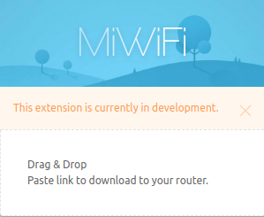

<p align="center">
  <br><br>
  <a href="https://travis-ci.org/socheatsok78/mi-wifi-en">
    
  </a>
  <a href="https://standardjs.com">
    
  </a>
</p>
<p align="center"><b>It is suck to not have English as an option!</b> <br> This extensioin will help you nagivate your MiWifi dashboard in English without dealing with the pain of `Google Translate`.</p>

## Installation

> Currently we don't have any build/release for you guys yet.

## Features
- Send downloadable link to your router
- Translate your MiWifi Dashboard to English (coming soon!)

## Screenshot


## Build Help

### Requirement

- Node JS - LTS [Installation](https://github.com/creationix/nvm)
- Ruby - Stable [Installation](https://www.digitalocean.com/community/tutorials/how-to-install-ruby-on-rails-with-rvm-on-ubuntu-16-04)
- RubyZip [GitHub](https://github.com/rubyzip/rubyzip)
- OpenSLL

### Compile

Run the following command to generate extension from source files

```sh
npm run dev
```

Then run the following command, this will output the extension in `build/miwifi-dev.crx`.

```sh
npm build:dev
```

## How to install from source

- In `Google Chrome` navigate to `chrome://extensions/` page via "..." -> More tools -> Extensions
- And check [x] Developer mode on the very top of the page
- Drag & Drop the compiled `build/miwifi-dev.crx` on to the extension window to install.
